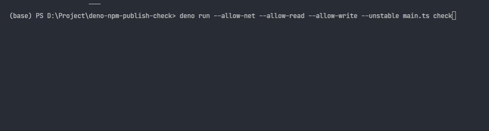

# deno-npm-publish-check 🦕

NPM 模块发包检测工具

程序会按配置好的地址读取 `package.json` 文件信息，并通过其中的 `publishConfig` 配置地址拼接包名查询发包的信息。然后对比版本号，查看版本差异。

版本号说明：
版本号需要遵循 [semver](https://semver.org/lang/zh-CN/) 规范，会按住版本号、次版本号、修订号的顺序比对，之后再比对先行版本号。如果先行版本号中是数字，则同样按顺序比对版本大小，非数字则仅比对字符串是否一致，不一致视为版本号无法比对。

## 使用说明

### 源码运行（需要安装 deno）

```
deno run --allow-net --allow-read --allow-write --unstable main.ts check
```



### Trex

如果安装了 `Trex` 可以直接使用命令

```
trex run check
```

### 编译成可执行文件

```
deno compile --allow-net --allow-read --allow-write --unstable --target x86_64-pc-windows-msvc main.ts
```

> --target 参数: x86_64-unknown-linux-gnu, x86_64-pc-windows-msvc, x86_64-apple-darwin, aarch64-apple-darwin

可以使用交叉编译分发其他平台的可执行文件。

### 可执行文件运行

```
npm-publish-check check
```

### 常用命令

```
   -h, --help                   帮助文档
   -c, --config <FILE>          指定配置文件路径 (默认./config.ts)
   -j, --jenkins <true|false>   是否触发Jenkins更新 (默认false)
   -t, --tags <TAG>             检查指定的tag版本信息
   -v, --verison                查看当前版本
   --on-error                   显示详细错误信息
   init                         生成默认的config.ts配置文件
   --name                       配合init指定生成文件名
   check                        按配置文件检查仓库中的包信息
```

## 配置文件说明

默认读取同目录下的 `config.jsonc` 文件，文件格式需要符合 `jsonc` 规范。  
使用 `init` 命令可以在当前目录下生成参考的配置文件。  
使用 `-c <FILE>` 命令运行指定目录的配置文件。  
使用 `-t <TAG>` 临时查询指定 tag 的版本信息，程序将不会按配置文件中的 `checkTags` 查询。

```
export interface CONFIG {
  /**
   * 需要检测的 tag 名称
   */
  checkTags: checkTags;
  /**
   * 全局的git配置
   */
  git: {
    cookie: string;
    cookiePath?: string; // cookie的存放文件 存在cookie优先使用cookie字段
    template?: string; // 全局 url模板  使用 {{}} {{=}} 符号定义替换变量名
    checkLoginURL?: string; // 登录页的路径
  }
  /**
   * 全局默认Jenkins查询配置
   * 可选项
   */
  jenkins: {
    /**
      * 全局 Jenkins cookie
      */
    cookie?: string;
    /**
     * 全局 Jenkins cookie 的存放文件 存在cookie优先使用cookie字段
     */
    cookiePath?: string;
    /**
      * 全局 url模板
      * 使用 {{}} 符号定义替换变量名
      * 使用 {{=}} 符号拼接带变量名的参数 如{{=cause}}替换为cause=参数值
      */
    template?: string;
    /**
      * 全局 Jenkins token
      * 拼接在访问的url之后 ?token=token
      */
    token?: string;
    /**
      * 全局 Jenkins cause参数值
      * 拼接在访问的url之后 ?cause=cause
      */
    cause?: string;
  };
  /**
   * package配置信息
   */
  package: {
    /**
     * key 为包名
     */
    [key: string]: {
      /**
       * key 为tag名称
       */
      [key: string]: {
        git:
          | URL // Git url  存在局部url优先使用url 无法使用变量
          | {
              /**
               * 模板使用变量
               * 其值会替换模板中相同名称的变量
               */
              [key: string]: string | undefined;
            };
        jenkins?: {
          /**
           * 局部 Jenkins cookie
           */
          cookie?: string;
          /**
           * Jenkins url
           * 存在局部url优先使用url 无法使用变量
           * 当前局部配置中存在token字段则会拼接token,否则将忽略全局token配置,直接访问url
           */
          url: string;
          /**
           * 模板使用变量
           * 除了以上保留关键字 其余值会替换模板中相同名称的变量
           */
          [key: string]: string | undefined;
        };
      };
    };
  };
}
```
